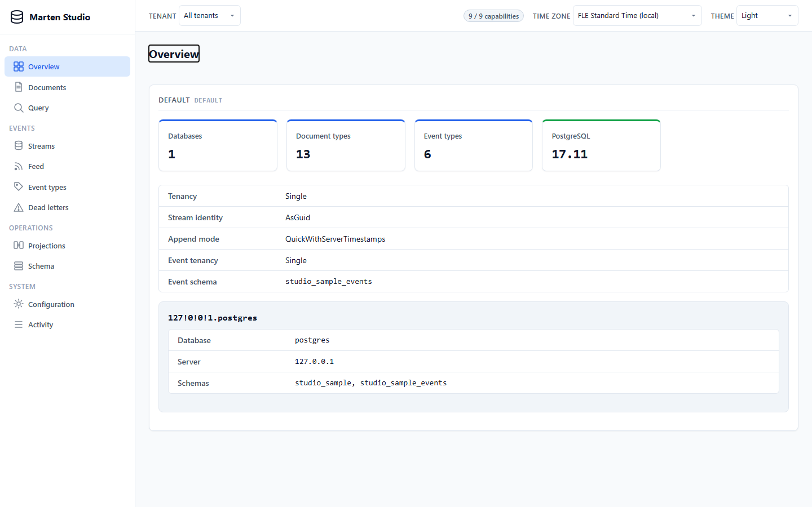
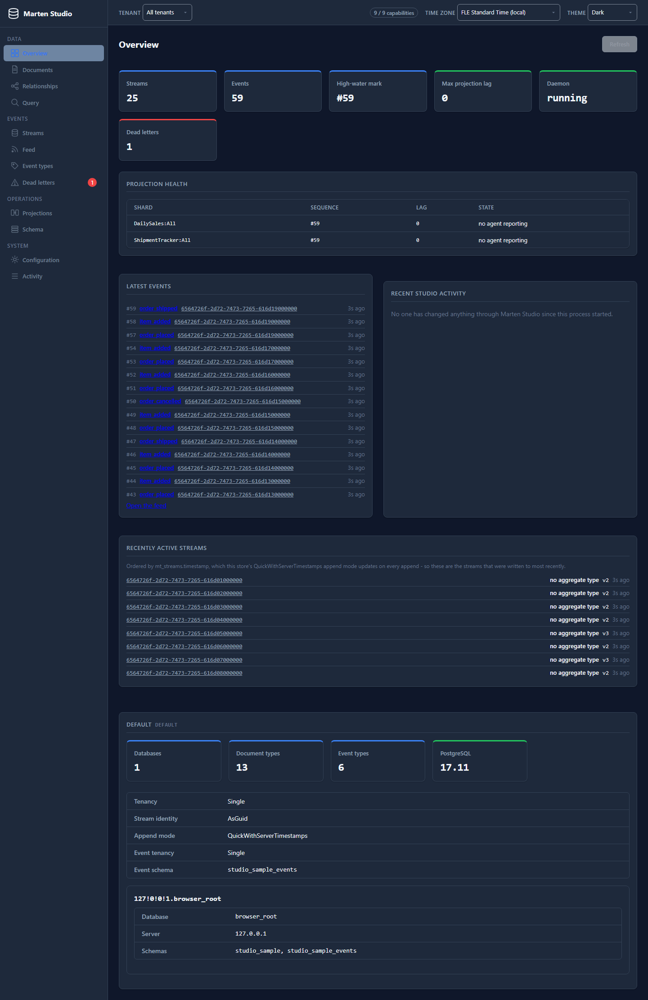
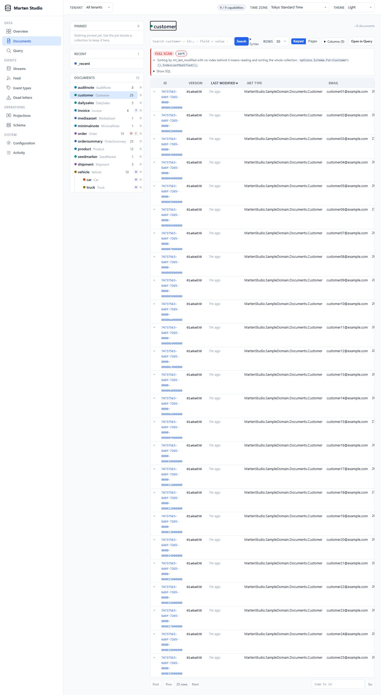
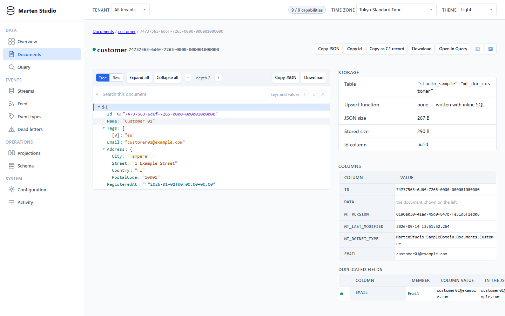
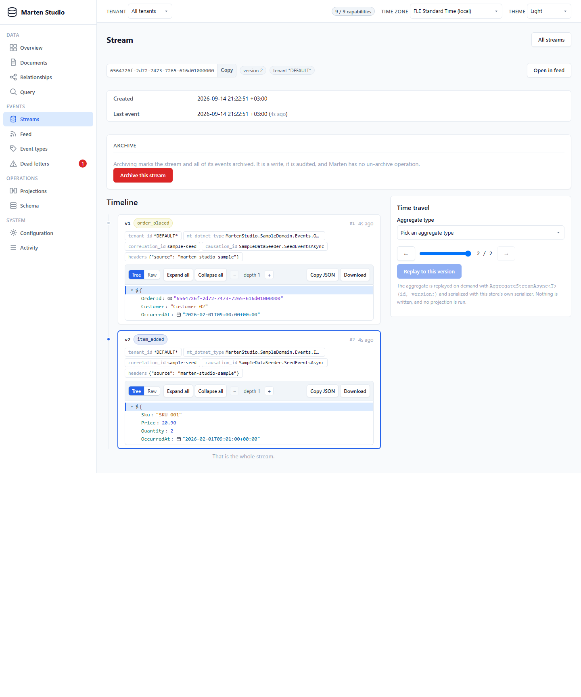
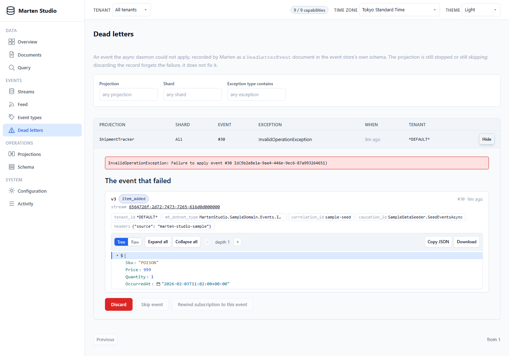
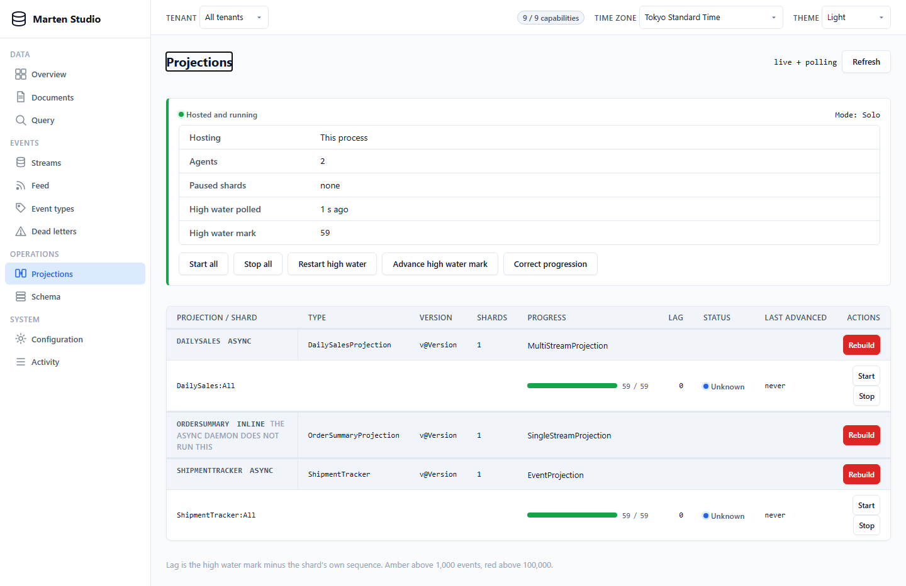
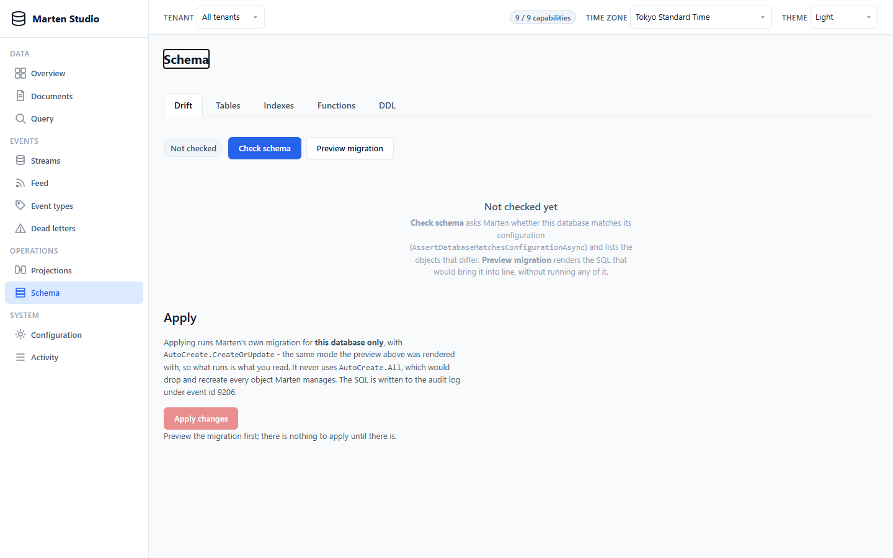

# Marten Studio

An embeddable Blazor Server admin UI for [MartenDB](https://martendb.io), shipped as one MIT-licensed
Razor Class Library. You add `AddMartenStudio()` to your container and `MapMartenStudio()` to your
endpoint pipeline, and the studio runs inside your own ASP.NET Core application against *that
application's own* configured `IDocumentStore` — browsing document collections and their JSON,
inspecting and steering event streams, projections and the async daemon, running guarded queries and
managing schema. Everything it knows, it knows because you configured Marten that way: aliases,
duplicated fields, soft delete, tenancy, projections and metadata columns all come from your
`StoreOptions`. That is the whole reason a Marten UI beats pgAdmin, and it is why the studio is keyed on
`IDocumentStore` and never on a connection string.

It is **not** a standalone application, **not** a fleet monitor and **not** a connection-string tool.
There is no "point it at a database" mode, and there never will be — a studio that could be aimed
anywhere would have to re-implement everything Marten already knows, and would get it subtly wrong. If
you want production telemetry for a fleet of Marten services, that is
[CritterWatch](https://jasperfx.net)'s job; if you want a general SQL client, that is pgAdmin's. The
niche in between — *this* process, *this* store, with Marten's own metadata in front of you and every
mutating action off until you turn it on — is what Marten Studio is for.

Registering the studio must never change how your application behaves. No global styles, no
component-library version pinned onto your host, no middleware ordering requirement, no altered
authentication, no second projection daemon. A host that adds the package and never maps it is
byte-for-byte the application it was.

## Screenshots

| | |
|---|---|
| [](docs/screenshots/overview-light.png) | [](docs/screenshots/overview-dark.png) |
| Overview — one card per store, with tenancy, stream identity and the databases behind it | The same page in the dark theme, which follows the picker in the header |
| [](docs/screenshots/documents-list.png) | [](docs/screenshots/document-detail.png) |
| Documents — the collections rail, the search grammar and its index verdict | One document: JSON on the left, everything the row's metadata columns say on the right |
| [](docs/screenshots/stream-detail.png) | [](docs/screenshots/dead-letters.png) |
| A stream's timeline, each event's JSON and headers, with aggregate time travel beside it | Dead letters, expanded to the failing event and its exception |
| [](docs/screenshots/projections.png) | [](docs/screenshots/schema-drift.png) |
| Projections and the async daemon: shard state, progression and the high-water mark | Schema — what Marten would change, before anything is applied |

## Install

```shell
dotnet add package MartenStudio
```

One package reference. The studio brings `Marten` (floor `9.35.0`) and
`Microsoft.AspNetCore.App.Internal.Assets` (floor `10.0.12`, three `.js` files and an MSBuild target, no
runtime assembly) and takes everything else — Blazor, SignalR, authorization, endpoint routing — from
the shared framework, so it pins no ASP.NET Core patch onto your application. Target framework:
`net10.0`.

## Register and mount

The minimum is two calls, and a decision about who may open it:

```csharp
builder.Services.AddMartenStudio();

// ...

app.MapMartenStudio().RequireAuthorization();
```

The studio is then at `/marten`, read-only, behind whatever `RequireAuthorization()` means in your
application. The sample host does the same thing with every option spelled out — this block is compiled
from [`samples/MartenStudio.Sample/Program.cs`](samples/MartenStudio.Sample/Program.cs), so it cannot
drift:

<!-- snippet: readme_register -->
```csharp
builder.Services
    .AddMarten(options => SampleStore.Configure(options, connectionString))
    .UseLightweightSessions()
    .AddAsyncDaemon(JasperFx.Events.Daemon.DaemonMode.Solo)
    .InitializeWith(new SampleDataSeeder());

builder.Services.AddMartenStudio(options =>
{
    // Who gets in, and who may change anything: the studio evaluates both against the host's own
    // authorization, and never authenticates anybody itself.
    //
    // --anonymous leaves AuthorizationPolicy unset on purpose. AllowAnonymous() on the mapping does win
    // over a configured policy - the studio's endpoints carry both and AllowAnonymous is what the
    // authorization middleware honours - but saying "this policy governs the studio" and then "anyone
    // may open it" in the same application is two answers to one question, and a demo should show the
    // one it means.
    options.AuthorizationPolicy = sample.Anonymous ? null : SamplePolicies.Studio;
    options.WriteAuthorizationPolicy = SamplePolicies.StudioWrite;

    // Every mutating operation is off until the host says otherwise. `All()` is the one-line, greppable
    // opt-in; `ReadOnly` overrides it whatever it says.
    options.Capabilities = sample.ReadOnly ? new MartenStudioCapabilities() : MartenStudioCapabilities.All();
    options.ReadOnly = sample.ReadOnly;

    // The demo's invoices are conjoined multi-tenant. Naming the tenants here is the cheapest of the
    // three discovery tiers and the only one that can answer before any events have been written.
    foreach (string tenantId in SampleStore.TenantIds)
    {
        options.KnownTenantIds.Add(tenantId);
    }
});
```
<!-- endSnippet -->

and the mapping:

<!-- snippet: readme_map -->
```csharp
IEndpointConventionBuilder studio = sample.Path is { Length: > 0 } path
    ? app.MapMartenStudio(path)
    : app.MapMartenStudio();

if (sample.Anonymous)
{
    // --anonymous: what an unauthenticated studio looks like. The startup guard accepts this because it
    // is an answer; it refuses only a mapping that says nothing at all.
    studio.AllowAnonymous();
}
else
{
    studio.RequireAuthorization(SamplePolicies.Studio);
}
```
<!-- endSnippet -->

`sample.Anonymous`, `sample.ReadOnly` and `sample.Path` are the demo's own command-line switches; in
your host they are just values. `AddMartenStudio()` may be called before or after `AddMarten()` — the
scan that finds your stores runs lazily, on first use, when the container is complete.

`MapMartenStudio("/ops/marten")` mounts the studio somewhere else. The pattern wins over
`MartenStudioOptions.Path`, and the pages, the static assets, the Blazor circuit and the framework
script all move with it.

## Authorization

There are three layers, and two process-wide switches on top of them. All five are yours to configure;
the studio authenticates nobody.

1. **`AuthorizationPolicy`** — *who gets in*. Applied to every studio endpoint: the pages, the Blazor
   circuit and the static assets. `RequireAuthorization()` on the builder returned by
   `MapMartenStudio()` does the same job, and covers the pages and the circuit.
2. **`StoreAuthorizationPolicy`** — *which store, database and tenant*. Resource-based, evaluated
   against a `MartenStoreResource`, and asked on **every** data call rather than only at the scope
   selector. Listings are filtered rather than annotated: a tenant you may not see is one you never
   learn exists.
3. **`WriteAuthorizationPolicy`** — *each mutating call*, against the same resource with the capability
   name attached. Falls back to `StoreAuthorizationPolicy` when you configure only one.

On top: **`ReadOnly`** turns every capability off whatever `Capabilities` says, and **`Capabilities`**
decides which mutating operations exist at all.

### The startup guard

A mapping that answers none of this refuses to start, before the web host binds a listener:

> Marten Studio is mapped with no authorization. Its pages can read and edit every document in every
> Marten store in this process, archive event streams, control the projection daemon, apply schema
> changes and run SQL, so Marten Studio refuses to start rather than serve that by accident. Say which
> you meant:
>
> - `app.MapMartenStudio().RequireAuthorization()` authorizes its pages and its Blazor circuit;
> - `services.AddMartenStudio(options => options.AuthorizationPolicy = "...")` authorizes those and the
>   static assets with them;
> - `app.MapMartenStudio().AllowAnonymous()` serves it to anyone, deliberately.
>
> A non-null `AuthorizationOptions.FallbackPolicy` satisfies this too, since it covers every endpoint
> that states nothing.

"I forgot to add `RequireAuthorization`" must not be a silent state, so it is a startup failure instead.

### What protects the circuit

Both `MartenStudioOptions.AuthorizationPolicy` and `RequireAuthorization()` on the returned builder
cover the Blazor circuit as well as the pages — the builder holds the studio's page endpoints *and* its
`/_blazor` endpoints, so a statement about the studio is a statement about both. That matters: the
circuit is the dangerous half, because it is the half that runs components. The studio stamps no
`AllowAnonymous` of its own on `/_blazor`.

The static assets under `_content/MartenStudio/` are package content — CSS and a little JS. With a
studio policy configured they carry it too; without one they opt out explicitly, so an application with
a fail-closed `FallbackPolicy` can still load the stylesheet.

### Resource-based authorization

`MartenStoreResource` is what the two store policies are evaluated against:

```csharp
public sealed record MartenStoreResource(
    string StoreName,           // "default", or the marker interface name of an ancillary store
    string DatabaseIdentifier,  // Marten's database identity - never a connection string
    string? TenantId,           // the selected tenant, or null for a view spanning all of them
    string? Capability);        // "EditDocuments", "RunSql", ... - or null for a read
```

One handler answers for the scope selector, the page frame and every data call. This example is
*illustrative* — it is not compiled from the sample, which uses plain claim policies:

```csharp
// Illustrative, not compiled.
public sealed class MartenStudioRequirement : IAuthorizationRequirement;

public sealed class MartenStudioHandler
    : AuthorizationHandler<MartenStudioRequirement, MartenStoreResource>
{
    protected override Task HandleRequirementAsync(
        AuthorizationHandlerContext context,
        MartenStudioRequirement requirement,
        MartenStoreResource resource)
    {
        // Reads: the tenant has to be one this user owns.
        bool mayRead = resource.TenantId is null
            || context.User.HasClaim("tenant", resource.TenantId);

        // Writes: the capability name arrives on the resource, so one handler can be as coarse or as
        // fine as you like - "ops may rebuild, nobody but me may run SQL".
        bool mayWrite = resource.Capability switch
        {
            null => true,
            "RunSql" => context.User.IsInRole("dba"),
            _ => context.User.IsInRole("ops"),
        };

        if (mayRead && mayWrite)
        {
            context.Succeed(requirement);
        }

        return Task.CompletedTask;
    }
}
```

Register it the usual way and name the policy:

```csharp
// Illustrative, not compiled.
builder.Services.AddSingleton<IAuthorizationHandler, MartenStudioHandler>();
builder.Services.AddAuthorizationBuilder()
    .AddPolicy("MartenStudioStore", policy => policy.AddRequirements(new MartenStudioRequirement()));

builder.Services.AddMartenStudio(options =>
{
    options.AuthorizationPolicy = "MartenStudio";
    options.StoreAuthorizationPolicy = "MartenStudioStore";
    options.WriteAuthorizationPolicy = "MartenStudioStore";
});
```

With no store policy configured, nothing is asked and everything passes — which is what keeps an
application that never set the option exactly as it was.

## Capabilities

Nine booleans, **all `false` by default**. A freshly mapped studio is a read-only browser.

| Capability | What it allows |
|---|---|
| `EditDocuments` | Edit a document's JSON and save it through the store's own serializer and session |
| `DeleteDocuments` | Delete, soft-delete and undelete documents, one at a time or a selection |
| `ArchiveStreams` | Archive an event stream |
| `ManageDeadLetters` | Discard dead-letter records, mark events as skipped, and rewind a subscription to the event that failed |
| `ControlDaemon` | Pause and resume the async daemon hosted in this process, start and stop individual projection agents while it is paused, and restart the high-water agent |
| `RebuildProjections` | Rebuild a projection |
| `CorrectProgression` | Advance the high-water mark, or correct projection progression in the database |
| `ApplySchemaChanges` | Apply pending schema migrations |
| `RunSql` | Run read-only SQL from the Query page's console |

```csharp
options.Capabilities = MartenStudioCapabilities.All();   // everything: the one-line, greppable opt-in
options.Capabilities.RebuildProjections = true;          // or one switch at a time, from all-off
options.ReadOnly = true;                                 // and this overrides whichever you wrote
```

Every disabled control says the exact property you would set, spelled the way you would write it:

> Editing documents is not enabled. Set `MartenStudioOptions.Capabilities.EditDocuments` to `true`, or
> `MartenStudioOptions.Capabilities = MartenStudioCapabilities.All()` to enable all of them.

and with the master switch on:

> `MartenStudioOptions.ReadOnly` is `true`, which turns every mutating operation off.

Hiding a button is a convenience. The refusal itself lives in the service layer, where the operation
does, because a Blazor circuit is a long-lived object a client can drive — and every refusal is written
to the audit log just like a success.

## Options

Every property of `MartenStudioOptions`. Validation runs at startup: a value outside the range given here
fails the host with a message that names the option.

| Option | Default | |
|---|---|---|
| `Path` | `/marten` | Where the studio is mounted. A plain rooted URL path. `MapMartenStudio(pattern)` overrides it. |
| `Title` | `Marten Studio` | Browser tab and sidebar heading. |
| `AuthorizationPolicy` | `null` | Policy applied to every studio endpoint — pages, circuit and static assets. |
| `StoreAuthorizationPolicy` | `null` | Policy evaluated against `MartenStoreResource` before a store, database or tenant is listed, framed or read. |
| `WriteAuthorizationPolicy` | `null` | Policy evaluated against `MartenStoreResource` with the capability named, before every mutation. Falls back to `StoreAuthorizationPolicy`. |
| `ReadOnly` | `false` | Master switch: every capability off, mutating controls not rendered, services refuse. |
| `Capabilities` | all off | Which mutating operations are enabled. |
| `DefaultPageSize` | `50` | Rows per page when a list is first shown. 1 … `MaxPageSize`. |
| `MaxPageSize` | `500` | The largest page a user may pick. 1 … 5000. |
| `QueryTimeout` | 30 seconds | `statement_timeout` on every query the studio issues. 1 second … 10 minutes. |
| `MaxInlineDocumentBytes` | 512 KiB | Documents larger than this are not fetched into list views and show as raw text in the detail view. 1 byte … 64 MiB. |
| `MaxSqlConsoleRows` | `500` | Row cap for the SQL console; the reader stops there rather than rewriting your statement. 1 … 10 000. |
| `SqlConsoleRole` | `null` | A Postgres role the SQL console **and the Marten `where` clause** switch to with `SET LOCAL ROLE` inside their read-only transaction. Must be a plain identifier — and must be able to `select` from the document tables, or the Query page answers `42501`. |
| `ExactCountThreshold` | `100000` | Above this estimated row count, collection counts stay `pg_class.reltuples` estimates, prefixed `~`, instead of becoming `count(*)`. |
| `RefreshInterval` | 5 seconds | How often live pages poll. Paused while the tab is hidden. 1 second … 5 minutes. |
| `RebuildShardTimeout` | 1 hour | The per-shard replay budget handed to Marten's rebuild. At least 1 minute — see the warning below. |
| `IsDocumentTypeVisible` | `null` | `Func<Type, bool>` filter over the registered document types, applied in the data layer and not only in navigation. |
| `IncludeAncillaryStores` | `true` | Whether stores registered with `AddMartenStore<T>()` appear beside the default `IDocumentStore`. |
| `KnownTenantIds` | empty | Tenant ids to offer in the selector. When non-empty, discovery is skipped. |
| `DiscoverTenantIds` | `true` | When `KnownTenantIds` is empty, whether to discover tenants from Marten's descriptors and then from a bounded query. |

> **`RebuildShardTimeout` is not a nicety.** A rebuild tears the projection's tables down *before* the
> timeout starts applying to the replay, so a rebuild that exceeds it stops with the tables already
> emptied and the operation recorded as failed. The default is an hour, where Marten's own no-timeout
> overload would have silently used five minutes. Set it generously.

## Screens

**Overview** — one card per registered store: databases, document types, event types, the PostgreSQL
version, tenancy, stream identity, event append mode and the schemas in play. A store that will not
build gets its own error region rather than blanking the page for the ones that do.

**Documents** — a collections rail with per-collection counts (estimates above `ExactCountThreshold`,
prefixed `~`, with exact counts on demand), then a list with column chooser, keyset paging and a search
grammar (`field:value`, `>=`, `is:deleted`, `tenant:…`) that compiles to parameterised SQL against the
duplicated columns and JSON paths Marten actually created. Each search gets an index verdict —
green/amber/red with the `StoreOptions` line that would fix it — and a "Show SQL" disclosure with the
statement that ran. The detail view puts the JSON viewer (tree or raw, search, copy, download, "copy as
C# record") beside a metadata panel of the row's real columns. With `EditDocuments` you edit the JSON
in place and see a **round-trip diff** before saving: Marten has no untyped write path, so the edit is
deserialized into the CLR type and serialized back, and any property the type does not have is *gone* —
the dialog lists dropped, changed and added properties and refuses the save until you acknowledge the
drops. Saves are optimistically concurrent (`UpdateExpectedVersion` / `UpdateRevision`); a row that
moved comes back as a conflict with nothing written. With `DeleteDocuments` you get delete (soft where
the mapping says soft, hard otherwise), undelete, and a bulk delete over the selection.

**Relationships** — the document types of the store as a graph: one node per registered type with its
collection colour, its .NET type and a `reltuples` estimate, one arrow per foreign key. What
`StoreOptions` declares and what `pg_constraint` actually holds are cross-checked, so an arrow is
*declared and enforced*, *declared only* — configured, never applied, nothing enforcing it — or *in the
database only*, which Marten does not know about and an apply under `CreateOrUpdate` would drop. Keys
with an end outside the store's document types are listed rather than drawn, and a type hidden by
`IsDocumentTypeVisible` appears nowhere at all. Clicking a node opens the collection; hovering an arrow
names the column, the target and the delete action. Beside the picture — and, on a narrow screen,
instead of it — a table carries the same relationships with the same links, which is also what a screen
reader gets. There is no pan, no zoom and no JavaScript: the layout is computed on the server and is a
pure function of the configuration, so the same store draws the same diagram every time. On a document's
detail page, **Referenced by** names each collection that points at it and how many of its documents do
— exact up to a thousand and "1,000+" beyond that, so the answer never costs a sequential scan — each row
linking to that collection already filtered on this document.

**Query** — two modes, and the asymmetry between them is the design. *Mode A, a Marten `where` clause*,
is a read against one document type and needs no capability, so the service holds it to being a
*clause*: no `;`, no statement of its own, brackets that balance, a tail that is
`[order by …] [limit n] [offset n]` and nothing else, no function that reads, writes or waits outside
the row, no `::regclass` cast — and, without `RunSql`, no subquery, union, join, `lateral` or
`returning` either. It runs inside the same `BEGIN; SET TRANSACTION READ ONLY; …; ROLLBACK` as the
console, under the same `QueryTimeout` and the same optional `SqlConsoleRole`. Results come back as the
`data` column itself, never round-tripped through a CLR type, the composed statement is shown, and a plan
is offered where `RunSql` allows one (`EXPLAIN`, never `EXPLAIN ANALYZE`). *Mode B, the SQL console*, is arbitrary
read-only SQL against the whole database, is gated on `RunSql`, and is limited by `MaxSqlConsoleRows`,
`QueryTimeout`, a 3-second lock timeout, a 60-second idle-in-transaction timeout and an optional
`SqlConsoleRole` — inside `BEGIN; SET TRANSACTION READ ONLY; …; ROLLBACK`. The row cap stops the reader;
it never appends a `LIMIT` to your statement. See [Security model and limits](#security-model-and-limits).

**Events** — *Streams* lists and filters streams; *stream detail* draws the timeline with each event's
JSON, headers and metadata, offers aggregate **time travel** (replayed on demand with
`AggregateStreamAsync<T>(id, version:)`, writing nothing and running no projection), and archives the
stream with `ArchiveStreams`. *Feed* is the global sequence, newest first, filtered by event type,
sequence range, stream, tenant and the archived/skipped flags the store actually has, with a follow
mode. *Event types* counts what the store has seen. *Dead letters* lists the daemon's failures with the
exception, and with `ManageDeadLetters` discards a record, marks the underlying event as skipped — only on
a store that enabled event skipping, because it writes `mt_events.is_skipped` and a store without that
column has no way to express the idea — or rewinds the projection's subscription to the event that failed,
behind a typed confirmation that states what gets replayed, where the daemon is hosted in this process.

**Projections** — every registered projection with its shards, their state and progression against the
high-water mark, refreshed from a lazy observer on `ShardStateTracker` where the daemon is hosted in
this process and from polling where it is not. With the capabilities on: pause and resume the projection
daemon, restart the high-water agent (`ControlDaemon`), rebuild a projection behind a typed confirmation
(`RebuildProjections`), and advance or correct progression (`CorrectProgression`). Pausing is
process-wide — it stops the coordinator's leadership runner and then every agent of every database this
process hosts for that store — and it is the only stop that holds: with the coordinator running, it
restarts any agent it finds missing within `LeadershipPollingTime`, so per-agent Start and Stop are
offered only while the daemon is paused and are refused with that reason while it is not. A rebuild
outlives the circuit that started it and is tracked by name. Where no daemon is hosted in this process,
the page says so — that is a value, not an error, and the studio never starts a daemon of its own.

**Schema** — five tabs: *Drift* (what Marten would change), *Tables*, *Indexes*, *Functions* and *DDL*.
Nothing here executes DDL on a read path: schema names, declared indexes, managed tables and installed
functions come from `StoreOptions` and Marten's own feature schemas, and `Check`, `Preview` and `DDL`
sit behind buttons that say on the button what they may create.

> **An apply runs under `AutoCreate.CreateOrUpdate`, and `CreateOrUpdate` is not additive.** Weasel's
> update path emits `drop index` for every physical index your configuration does not declare,
> `drop column` for every extra column, `alter column … type` for a changed one,
> `alter table … drop constraint … CASCADE` for a changed primary key, and for a changed partition
> scheme a `create table … as select` / `drop table … cascade` pair that copies the whole table out and
> back. The preview is rendered under the same mode so what you read is what would run, and the
> destructive statements are listed in the dialog before a typed confirmation. **A hand-made index is
> dropped by the next apply** unless you declare it, or name it in
> `opts.Schema.For<T>().IgnoreIndex("…")` — or `opts.Events.IgnoreIndex("…")` on an event table — which
> takes it off both sides so it is neither created nor dropped. The Indexes and Drift tabs say this on
> screen, and name the index.

**Configuration** — everything your application told Marten, read back out: serializer, tenancy, schema
names, metadata columns, projections, the databases. Never a connection string and never a credential; a
database is identified by server, port, name and schema. The studio changes nothing here.

**Activity** — the last 500 actions taken through the studio in this process, newest first, with user,
scope, action, target, outcome, capability and message. It is in memory and goes away with the process.
The durable record is your own `ILogger`, under event ids 9200–9211.

## Multi-tenancy, multiple databases and multiple stores

Scope is a triple — **store, database, tenant** — chosen in the header and carried in the query string
(`?store=&db=&tenant=`), so a link you paste into a chat reopens the same thing. Every data call
resolves that scope and re-asks `StoreAuthorizationPolicy` about it.

- **Stores.** The default `IDocumentStore` is `default`; every store registered with
  `AddMartenStore<T>()` appears under its marker interface's name. `IncludeAncillaryStores = false`
  hides the ancillary ones. A store that will not build is shown as an unavailable row with the reason,
  not silently omitted.
- **Databases.** A `MultiTenantedDatabases` or otherwise multi-database store lists its databases;
  sessions are always opened with `SessionOptions.ForDatabase(tenantId, database)` so the reads come
  from the database the selector named and the audit entry recorded. Everything schema-related is per
  *database*, never per store.
- **Tenants.** Three discovery tiers, cheapest first: `KnownTenantIds` (you said so — nothing is
  discovered); Marten's own `DescribeDatabasesAsync`, which answers for a static configuration without
  touching the database; and, when `DiscoverTenantIds` allows it, a bounded `select distinct` over every
  table in the store that has a tenant column, capped at 201 rows and cached for a minute. Past 200
  tenants the selector becomes a free-text box, because a picker that silently omits tenants is worse
  than no picker. The selector says which tier answered.

Conjoined tenancy is per document type, so a store whose documents are tenanted while its event store is
not is the normal case and is handled: a single-tenanted collection is not filtered by the scope's
tenant, because there is nothing to filter on and hiding it would hide something genuinely shared.

## Hosting notes

- **It works in an API-only host.** No `.razor` file of your own is needed, and you do not need to set
  `RequiresAspNetWebAssets` — the package references `Microsoft.AspNetCore.App.Internal.Assets`, whose
  `buildTransitive` targets define `_framework/blazor.web.js` as *your* project's static web asset.
  Verified against a scratch API-only host that has no Blazor components at all.
- **You do not need `app.UseAntiforgery()`.** The studio has no `<form>` and no `<EditForm>`; every
  mutation is a Blazor event over the circuit, and SignalR's own same-origin check is what stands
  between a cross-site page and that circuit. The studio's component endpoints say
  `.DisableAntiforgery()`, so a host that never calls the middleware still gets a 200 for `GET /marten`.
  A host that *does* call it is unaffected — the middleware simply has nothing to validate here.
- **Sub-path mounting is a first-class shape.** `MapMartenStudio("/ops/marten")` moves the pages, the
  `/_blazor` circuit, the `opaque-redirect` endpoint, `blazor.web.js` and the
  `_content/MartenStudio/` mirror under the path, and the shell renders a studio-rooted `<base href>`.
  Every mount is studio-rooted — including the default `/marten` — so a host that has a Blazor app of
  its own does not end up with two endpoints on `/_blazor`.
- **Behind a reverse proxy**, forward the studio prefix and it works: the studio's plumbing is all under
  its own path. If the proxy strips a prefix, give the application the same prefix with
  `app.UsePathBase("/…")` so that the routes and the `<base href>` agree; mounting at
  `MapMartenStudio("/ops/marten")` and stripping `/ops` at the proxy without a matching `UsePathBase` is
  the shape that renders locally and 404s in production.
- **Static assets.** `app.MapStaticAssets()` (or `UseStaticFiles()`) serves the stylesheet the normal
  way. The studio also maps its own `_content/MartenStudio/{**path}` endpoints as a fallback, so an
  API-only host that configures neither still gets a styled, interactive studio.
- **Not trimmable.** `IsTrimmable=false` is stated in the csproj on purpose. Blazor Server sets
  `[Parameter]` properties by name from the render tree and the document viewer deserializes into types
  discovered from `IDocumentType.DocumentType` at run time; a trimmer told it may cut has no way to see
  either. An application that publishes trimmed or native AOT does so without the studio.
- **There is no "integrate into my own Blazor app" mode.** The studio maps its own
  `MapRazorComponents<MartenStudioApp>()` root and re-roots it. Adding its pages to your own router is
  not supported in v1.

## Sample application

```shell
dotnet run --project samples/MartenStudio.Sample
```

Then open <http://localhost:5210>. With no connection string configured, the sample starts a throwaway
PostgreSQL container, prints a loud banner saying it did, and seeds a demo domain chosen to make the
studio's screens worth looking at: a duplicated unique column, a soft-deleted type with a foreign key and
optimistic concurrency, a strong-typed id, a subclass hierarchy in one table, application-assigned string
keys, one type with every optional metadata column on and one with all of them off, a two-megabyte
document, conjoined multi-tenant invoices, and an event store with three projections, one archived stream
and one deliberately poisoned stream that the async daemon turns into dead letters. It never falls back
to `localhost` silently; without Docker it throws with guidance. Set `ConnectionStrings:Marten` to point
it at a database of your own.

Sign in as `admin`, `ops` or `viewer` — the password is the user name. They differ by claim: `admin` has
read, write and destroy, `ops` read and write, `viewer` read only, which is how you can see what each
layer of the authorization contract does.

| Switch | |
|---|---|
| `--anonymous` | Map the studio with `AllowAnonymous()` instead of a policy, to show what an unauthenticated studio looks like. The landing page draws a red banner saying so. Never do this anywhere real. |
| `--readonly` | Set `MartenStudioOptions.ReadOnly`, which turns every mutating capability off however they were configured. |
| `--path /ops/marten` | Mount the studio somewhere other than `/marten`, which is what exercises the sub-path re-rooting. |

> **Argument order does not matter.** The sample's boolean switches — `--anonymous`, `--readonly`,
> `--allow-data-generation` — are switches, not `--key value` pairs: writing one means `true` and the
> token after it is left alone, so `dotnet run -- --anonymous --urls http://localhost:5000` and
> `dotnet run -- --urls http://localhost:5000 --anonymous` do the same thing. An explicit value is
> still accepted where a script wants to pass a variable (`--readonly false`, `--readonly=false`), and
> only a literal `true` or `false` counts as one. `--path /ops/marten` is a pair and does take the
> token after it. This needs saying because .NET's own command-line configuration provider does *not*
> work that way — it reads `--key value` pairs, so a bare switch would otherwise swallow your `--urls`
> and then drop the URL without a word; `SampleOptions.HostArguments` reconciles the two before the
> host sees the arguments.

### Demo data generator

In the `Development` environment (or with `--allow-data-generation` elsewhere) the sample's landing page
carries a **Demo data** panel for the `admin` user — presets **Small**, **Medium** (about 100 k documents
and 100 k events), **Large** (about 1.2 M documents, 1.25 M events across 250 k streams) and **Custom** —
that runs as a cancellable background job with a progress bar, rows per second, an ETA and the async
daemon's lag, plus a truncate that removes exactly what was generated. Documents go in through a binary
`COPY`; order streams go through Marten sessions so the inline projection runs and the async ones have
something to catch up on, with one poisoned stream per 10 000 so the dead-letter screen has real content.
The studio's own services are measured against the Medium set in every integration run; the Large set
runs under `MARTENSTUDIO_LARGE=1`. See [`samples/MartenStudio.Sample/README.md`](samples/MartenStudio.Sample/README.md).

## Security model and limits

The long form is in [`docs/security.md`](docs/security.md). The short form:

- **Nothing mutating is on by default.** Nine capability flags, all `false`, plus `ReadOnly`. The
  dashboard that is dangerous by default is the one somebody maps without reading the docs.
- **Refusals live in the service layer**, not in the markup, and are audited whether they succeed or
  fail: `StudioCapabilityGuard.Require(…)` → scope resolution with the write policy → the operation →
  the audit record.
- **The SQL console's real guard is the transaction, not the parser.** Every statement runs inside
  `BEGIN; SET TRANSACTION READ ONLY; …; ROLLBACK` with `statement_timeout`, `lock_timeout`,
  `idle_in_transaction_session_timeout` and an optional `SET LOCAL ROLE`, all set with `set_config`
  parameters rather than interpolated text. `ReadOnlySqlGuard` — which allows only `select`, `with`,
  `explain`, `table` and `values`, and only one statement — exists to produce a better message than
  SQLSTATE `25006`, and treating it as the security boundary is how these features get CVEs.
- **A read-only transaction is not a sandbox.** `select pg_terminate_backend(pg_backend_pid())` runs
  happily inside one; so do `pg_read_file`, `lo_export`, `pg_ls_dir`, `dblink` and the session-level
  advisory-lock family. Those are refused **by name** through a denylist
  (`ReadOnlySqlGuard.DisallowedFunctions`, quoted in full in `docs/security.md`), and that refusal is
  worth exactly what a parser's refusal is worth: a determined caller can reach the same function
  through a view, a `SECURITY DEFINER` wrapper or an alias, and the list will not see it.
- **The only true narrowing is `SqlConsoleRole`.** A Postgres role that was never granted `EXECUTE` on
  those functions, and can read only what you meant it to read, cannot be talked around however the call
  is spelled. Configure one if you enable the console. Without it, the console reads everything the
  store's own Postgres role can read — every table in the database, Marten's or not.
- **Grant `RunSql` only to people you would give `psql` to.** That is the whole of it.
- **Mode A is guarded differently, because it needs no capability.** The studio composes the statement
  itself — `select … from <table> as d where 1 = 1 and <tenant> and <not deleted> and ( <your clause> )
  and <tenant> and <not deleted>` — so the tenant in the header and the soft-delete rule apply exactly as
  they do in the Documents browser, and the SQL the page shows is the SQL that ran. The studio's terms
  are repeated *after* your predicate as well as before it, because a parenthesised predicate only
  contains an `or` while the parentheses hold. The clause may not carry a second statement, be a
  statement of its own, leave a bracket unbalanced, hang anything but a sort list off `order by`, call a
  function that reads, writes or waits outside the row, or cast to `regclass`/`regproc` — **none of
  which `RunSql` lifts**. What `RunSql` lifts is reaching another relation: subquery, union, join,
  `lateral`, `returning`. The scanner errs towards refusing, and every refusal names what would lift it.
- **Audit.** Every mutating operation and every refusal is written to a 500-entry in-memory ring (the
  Activity page) *and* to your `ILogger` under event ids **9200–9211**, which is the copy that survives a
  deployment. 9200 `ActionPerformed`, 9201 `ActionFailed`, 9202 `CapabilityDenied`, 9203
  `ScopeAuthorizationDenied`, 9204 `SqlExecuted`, 9205 `SqlRejected`, 9206 `SchemaChangeApplied`, 9207
  `ProjectionRebuildStarted`, 9208 `ProjectionRebuildFinished`, 9209 `DaemonControlRequested`, 9210
  `StoreUnavailable`, 9211 `DocumentWriteRoundTripDropped`. The range 9200–9299 is reserved.
- **What the studio never does:** start a second projection daemon, execute DDL on a read or navigation
  path, write document DML of its own, replace your `StoreOptions.Logger`, or show a connection string
  or a credential anywhere.

## Current limitations

- **Mode A takes no parameters.** The clause is handed to Marten as SQL text; there is no `?`/`@p`
  binding, so a literal you paste in is SQL too. What keeps that from being an ungated console is the
  clause guard — no second statement, balanced brackets, the function denylist, and without `RunSql` no
  nested read — together with the read-only transaction it runs in; not a parameter you could have put
  the value in safely.
- **No push, no hub.** Live pages poll at `RefreshInterval` through a single-flight snapshot cache,
  paused on hidden tabs; only projection state gets sub-second updates, and only where the daemon is
  hosted in this process. There is no SignalR hub of the studio's own in v1 — adding one would add a
  host-visible endpoint for something polling covers.
- **No patch, no bulk update.** Documents are edited one at a time through a full round trip. Deleting
  a selection is supported; changing one is not.
- **Earlier versions of a document are only visible where there is an event stream.** Marten keeps one
  row per document, so the studio can show you the current document and — for an aggregate — replay its
  stream to any version. There is no per-document history for a plain document type.
- **Editing a hierarchy row has edges.** A subclass row is previewed and saved as the subclass, but a
  row stamped with a subclass this process does not map, or a hierarchy row with no discriminator under
  an abstract root, is **refused by name** rather than rewritten as its root type. Undelete is refused
  outright for a document whose id the studio cannot build a typed expression for.
- **No "integrate into my own Blazor app" mode.** The studio maps its own component root; its pages
  cannot be added to your router (D11).
- **No keyboard cheat sheet.** The JSON viewer, its search bar and the editor have keyboard handling,
  but there is no global shortcut map and no page that lists what exists.
- **No live SQL tail.** It would require replacing your `StoreOptions.Logger`, which is exactly the
  "registration changes host behaviour" failure this project refuses. Every generated grid carries a
  "Show SQL" disclosure instead.
- **Read-only and the capabilities are process-wide**, not per store, per database or per tenant. *Which*
  scopes a visitor sees is expressible, through `StoreAuthorizationPolicy`; "this tenant may edit but not
  delete" is not.
- **Counts are estimates above `ExactCountThreshold`.** A `~` prefix says so, and an exact count is one
  click away, under `statement_timeout`.
- **A mapping made after the host has started is never checked** by the startup guard — from a hosted
  service, or a lazily built `EndpointDataSource`. Map the studio while the application is being built.
- **Marten Studio is a store console, not an ETL tool.** Import, dumping a whole collection, copying
  between stores and scripted migration are outside it. The Query page exports the page you are looking
  at — the row cap has already stopped the reader by then — and never a table.

## Building from source

```powershell
.\build.ps1 Test                 # restore, compile, run both test projects
.\build.ps1 Test --playwright    # ... and install the Chromium build the browser suite drives first
.\build.ps1 Pack                 # the NuGet package into artifacts/packages
```

The fast suite needs nothing:

```powershell
dotnet test tests\MartenStudio.Tests
```

The integration suite needs Docker — run `docker info` first. It starts one `postgres:17-alpine` through
Testcontainers and reuses it between runs locally. **Any run that might overlap another must opt out**,
because schema names derive from test class names and two runs on one reused container drop each other's
tables:

```powershell
$env:MARTENSTUDIO_PG_REUSE='false'
dotnet test tests\MartenStudio.Integration.Tests
```

(`TESTCONTAINERS_REUSE_ENABLE` is not read by Testcontainers 4.x and must not be used.)

`.\build.ps1 Browsers` installs the Chromium build the browser tests drive. It is deliberately opt-in
locally — a developer should not pay a 150 MB download for a test run — and automatic on CI, where a
missing browser has to be a failure rather than a silent skip.

## Contributing

`AGENTS.md` at the repository root is the single source of truth for this codebase: the hard rules, the
numbered design decisions with their rationale, the package budget and the directory layout. Read it
before opening a pull request — several of the rules exist because the obvious thing was tried and broke
something.

## License

MIT. See [LICENSE](LICENSE).
